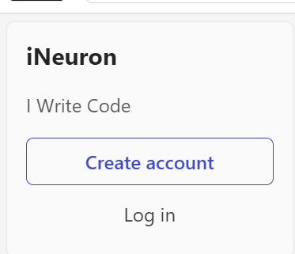

# Dom Manipulation Assignment

1. Webiste Name: [Dev To](https://dev.to/)

### Topics

    - Query Selctory, Inner HTML

### Sample Image

### Tasks

        Target the Top description div and change the DEV Community to <Your_Name> and description to your passion

### Output

### code 

     document.querySelector(".side-bar .crayons-card .crayons-subtitle-2")

     document.querySelector(".side-bar .crayons-card .crayons-subtitle-2").innerHTML="iNeuron"

4. Webiste Name: [OnePlus](https://www.oneplus.in/support)

### Topics

     Query Selector, InnerText

### Sample Image

### Tasks

      Change the contact number

### Output

### code 

     document.querySelector(".customer-support .one-tel-number")

     document.querySelector(".customer-support .one-tel-number").innerText="+91 6366256689"

6. Webiste Name: [Adidas](https://www.adidas.co.in/)

### Topics

    -   Query Selector, Event listeners, Changing Styles

### Sample Image

### Tasks

     Target the search box and on hover change thebackground color to red.

### Output

### code

     document.querySelector(".searchinput___19uW0")

     document.querySelector(".searchinput___19uW0").style.backgroundColor="red"

9. Webiste Name: [Code Wars](https://www.codewars.com/)

### Topics

       Change Font Family, Color of Text.

### Sample Image

### Tasks

    Change the font family of the text to monospace and text color to the logo’s background color.

### Output

### code

     document.querySelector(".section .container .content-width-extra-large .display-heading-1").style.fontFamily="monospace

     document.querySelector(".section .container .content-width-extra-large .display-heading-1").style.color="red"

11. Webiste Name: [realme](https://www.realme.com/in/)

### Topics

       querySelector,style,background-image

### Sample Image

### Tasks

    change the realme logo to ineuron logo

### Output

### code

     document.querySelector(".header .wrapper .logo .icon")

     document.querySelector(".header .wrapper .logo .icon").style.backgroundImage="url('https://ineuron.ai/images/ineuron-logo.png')"

13. Webiste Name: [Hackerrank](https://www.hackerrank.com/)

### Topics

       querySelector,innerHtml

### Sample Image

### Tasks

Target the top description and change “Matching developers with great companies” to ‘JSBOOTCAMP“.

### Output

### code

     document.querySelector(".fl-heading-text").innerText

     document.querySelector(".fl-heading-text").innerText="JSBOOTCAMP"

14. Webiste Name: [Asus](https://www.asus.com/in/)

### Topics

      querySelector,style,font-size

### Sample Image

### Tasks

       change the fontsize of “Hot Deals” to 80px

### Output

### code

     document.querySelector(".HotDealsAll__Heading__2fIbe").innerText

     document.querySelector(".HotDealsAll__Heading__2fIbe").style.fontSize="80px"